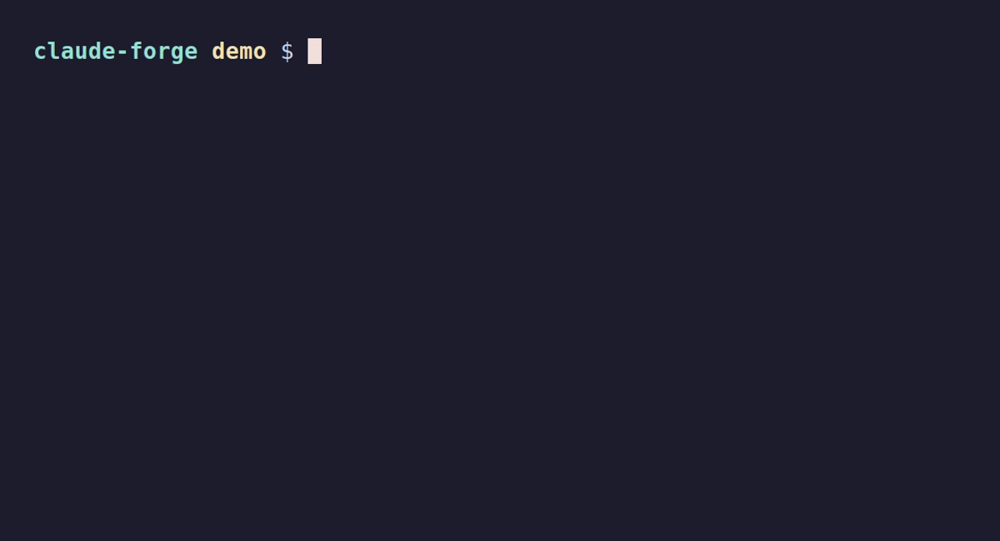

<div align="center">

<picture>
  <source media="(prefers-color-scheme: dark)" srcset="docs/assets/logo-dark.svg">
  <source media="(prefers-color-scheme: light)" srcset="docs/assets/logo-light.svg">
  
</picture>

<br><br>

**Security & Productivity Hooks for Claude Code CLI**

<br>

[](CHANGELOG.md)
[](https://github.com/reze83/claude-forge/actions)
[](#)
[](LICENSE)
[](#)

<br>

<!-- Demo GIF — generate with: vhs docs/assets/demo.tape -->


<br>

</div>

---

claude-forge schuetzt Claude Code vor destruktiven Befehlen, Secret-Leaks und unsicheren Dateioperationen — vollautomatisch via Hook-System. Dazu kommen Auto-Formatierung, Multi-Model-Workflows (Claude + Codex) und Self-Management-Commands.

<table>
<tr>
<td width="50%" valign="top">

### Was es tut

- Blockt `rm -rf /`, `git push main`, `chmod 777` live
- Scannt 11 Secret-Patterns vor dem Schreiben
- Schuetzt `.env`, `.ssh/`, `.aws/`, `*.pem`, `*.key`
- Formatiert Code automatisch nach jedem Edit
- Delegiert Tasks an Codex CLI (Multi-Model)

</td>
<td width="50%" valign="top">

### Was es mitbringt

- **18 Hooks** — Security, Productivity, Logging
- **9 Rules** — Git, Security, Code-Standards, Performance, API-Design, ...
- **5 Agents** — Research, Test-Runner, Security-Auditor, Dep-Auditor, Profiler
- **6 Skills** — Code-Review, Explain, Deploy, Project-Init, Test-Gen, Refactor
- **9 Commands** — Multi-Model Workflows + Self-Management

</td>
</tr>
</table>

---

## Installation

```bash
git clone https://github.com/reze83/claude-forge.git "${XDG_DATA_HOME:-$HOME/.local/share}"/claude-forge
cd "${XDG_DATA_HOME:-$HOME/.local/share}"/claude-forge
bash install.sh
```

> [!TIP]
> Der Clone-Pfad ist frei waehlbar — `install.sh` erkennt seinen Standort automatisch.
> Mit `--with-codex` wird zusaetzlich Codex CLI fuer Multi-Model-Workflows installiert.
> Mit `--dry-run` werden alle Schritte nur angezeigt, ohne etwas zu aendern.

<details>
<summary><strong>Alternative: Plugin-Modus</strong></summary>

```bash
claude --plugin-dir <pfad-zum-repo>
```

> [!WARNING]
> **Nicht beides gleichzeitig nutzen** — Hooks wuerden doppelt geladen!

</details>

---

## Security

claude-forge schuetzt mit drei Schichten — alle Hook-enforced, nicht umgehbar:

<table>
<tr>
<td width="33%" valign="top">

### Bash-Firewall

Blockt destruktive Befehle in Echtzeit:

- `rm -rf /`, `mkfs`, `dd of=/dev/`
- `git push main`, `--force`, `reset --hard`
- `eval`, `bash -c`, `exec`, `source`
- `chmod 777`, `chmod o+w`
- Bypass-Schutz: Prefixes, Refspec, getrennte Flags

</td>
<td width="33%" valign="top">

### Secret-Scanner

11 Patterns, Pre- und Post-Write:

- Anthropic, OpenAI, AWS
- GitHub (PAT, OAuth, Server, Refresh)
- JWT, PEM, Stripe, Slack, Azure
- Pre-Write: **blockt** vor dem Schreiben
- Post-Write: **warnt** nach dem Schreiben
- `# pragma: allowlist secret` pro Zeile

</td>
<td width="33%" valign="top">

### File-Protection

Sensible Dateien sind tabu:

- `.env`, `.ssh/`, `.aws/`, `.gnupg/`
- `*.pem`, `*.key`, `*.p12`, `*.pfx`
- `.npmrc`, `.netrc`, `*.keystore`
- `.claude/hooks/`, `settings.json`
- Allowlist: `.env.example`, `.env.sample`

</td>
</tr>
</table>

<details>
<summary><strong>Eigene Block-Patterns definieren</strong></summary>

```bash
# ~/.claude/local-patterns.sh — ERE-Syntax (grep -E)
LOCAL_DENY_PATTERNS=(
  'docker\s+push'
  'curl\s+.*-k'
  'npm\s+publish'
)
LOCAL_DENY_REASONS=(
  "docker push geblockt — nur via CI/CD"
  "curl -k (insecure) geblockt — Zertifikate pruefen"
  "npm publish geblockt — nur via CI/CD"
)
```

Testen ohne zu blocken: `CLAUDE_FORGE_DRY_RUN=1` (gilt fuer bash-firewall, protect-files, secret-scan-pre, url-allowlist)

</details>

---

## Hooks

<table>
<tr><th>Hook</th><th>Event</th><th>Funktion</th></tr>
<tr><td><code>bash-firewall</code></td><td>PreToolUse</td><td>Destruktive Befehle + Injection blocken</td></tr>
<tr><td><code>protect-files</code></td><td>PreToolUse</td><td>Sensible Dateien schuetzen</td></tr>
<tr><td><code>secret-scan-pre</code></td><td>PreToolUse</td><td>Secrets VOR Write/Edit blocken</td></tr>
<tr><td><code>auto-format</code></td><td>PostToolUse</td><td>Code formatieren (async) — prettier, ruff, rustfmt, gofmt, shfmt</td></tr>
<tr><td><code>secret-scan</code></td><td>PostToolUse</td><td>Secrets nach Write/Edit warnen</td></tr>
<tr><td><code>smithery-context</code></td><td>UserPromptSubmit</td><td>Verbundene MCP-Server als Context injizieren</td></tr>
<tr><td><code>session-start</code></td><td>SessionStart</td><td>Forge-Version + Session-Logging</td></tr>
<tr><td><code>post-failure</code></td><td>PostToolUseFailure</td><td>Tool-Fehler Logging + Context</td></tr>
<tr><td><code>pre-compact</code></td><td>PreCompact</td><td>Context-Compaction Logging</td></tr>
<tr><td><code>subagent-start</code></td><td>SubagentStart</td><td>Subagent-Spawn Logging</td></tr>
<tr><td><code>subagent-stop</code></td><td>SubagentStop</td><td>Subagent-Completion Logging</td></tr>
<tr><td><code>stop</code></td><td>Stop</td><td>Turn-Completion + Desktop-Notification</td></tr>
<tr><td><code>task-gate</code></td><td>TaskCompleted</td><td>Quality Gate vor Task-Abschluss (opt-in)</td></tr>
<tr><td><code>teammate-gate</code></td><td>TeammateIdle</td><td>Uncommitted-Changes Check (opt-in)</td></tr>
<tr><td><code>url-allowlist</code></td><td>PreToolUse</td><td>Private/interne URLs bei WebFetch blocken</td></tr>
<tr><td><code>pre-write-backup</code></td><td>PreToolUse</td><td>.bak-Backup vor Write/Edit (opt-in)</td></tr>
<tr><td><code>session-logger</code></td><td>SessionEnd</td><td>Session-Ende Notification + Log-Rotation</td></tr>
<tr><td><code>setup</code></td><td>Setup</td><td>Dependency-Check + Symlink-Health (Plugin-Modus)</td></tr>
</table>

Alle Hooks nutzen `hooks/lib.sh` mit `block()`, `warn()`, `context()` und 11 shared Secret-Patterns.

---

## Multi-Model (Claude + Codex)

Claude orchestriert, Codex implementiert — 5 Workflow-Commands:

| Command           | Sandbox  | Beschreibung                                                                 |
| ----------------- | -------- | ---------------------------------------------------------------------------- |
| `/multi-workflow` | write    | 6-Phasen-Workflow: Analyse → Planung → Codex → Claude → Integration → Review |
| `/multi-plan`     | read     | Parallele Implementierungsplaene vergleichen                                 |
| `/multi-execute`  | variabel | Direkte Codex-Delegation mit waehlbarem Sandbox-Modus                        |
| `/multi-backend`  | read     | Backend/Algorithmen-Task an Codex                                            |
| `/multi-frontend` | read     | Claude implementiert Frontend, Codex reviewed                                |

```bash
# Setup
bash install.sh --with-codex
# oder nachtraeglich:
bash multi-model/codex-setup.sh
```

> [!NOTE]
> Codex CLI erfordert ein ChatGPT Plus oder Pro Abo. Sandbox-Modi: `read` (nur lesen), `write` (Projektordner), `full` (voller Zugriff — nur auf Anfrage).

---

## Self-Management

```
/forge-status    Version, Symlink-Health, Hooks, verfuegbare Updates
/forge-update    One-Command Update direkt aus Claude Code
/forge-doctor    Diagnostik + Auto-Repair
/changelog       CHANGELOG aus Git-History generieren
```

```bash
bash update.sh          # git pull + neue Dependencies + neue Symlinks
bash update.sh --check  # Nur pruefen ob Updates verfuegbar
bash validate.sh        # Konfig-Validierung + Secret-Scan
```

---

## Voraussetzungen

`install.sh` installiert fehlende Dependencies automatisch (apt/brew/pip/npm mit Fallbacks).

|               | Pakete                                                    |
| ------------- | --------------------------------------------------------- |
| **Pflicht**   | git, jq, node >= 20, python3 >= 3.10                      |
| **Formatter** | shfmt, ruff, prettier (automatisch installiert)           |
| **QA-Tools**  | shellcheck, bats, markdownlint-cli2, gitleaks, actionlint |
| **Optional**  | Codex CLI (`--with-codex`), Smithery CLI                  |

---

<details>
<summary><strong>Troubleshooting</strong></summary>

### Installation

**Dependencies fehlen** — `install.sh` installiert alles automatisch via apt-get, brew, pip oder npm mit mehreren Fallbacks.

**ruff laesst sich nicht installieren** — Auf Debian/Ubuntu ohne python3-pip nutzt der Installer automatisch ein venv und verlinkt nach `~/.local/bin/`.

**prettier/codex nicht gefunden** — Der Installer erstellt bei Bedarf einen Symlink nach `~/.local/bin/`. Am Ende wird eine PATH-Empfehlung angezeigt.

### Hooks

**Eigene Scripts blockiert** — Die Bash-Firewall hat 26 Deny-Patterns mit konkreten Alternativen in der Fehlermeldung. Eigene Ausnahmen ueber `local-patterns.sh`.

**False Positive bei Secrets** — `# pragma: allowlist secret` am Zeilenende unterdrueckt den Scan fuer diese Zeile.

### Codex CLI

**Timeout** — Standard 240s (Range: 30-600s). Bei Timeouts: Aufgabe kleiner formulieren statt Timeout erhoehen.

**"Not inside a trusted directory"** — Der Wrapper setzt `--skip-git-repo-check` automatisch fuer Nicht-Git-Verzeichnisse.

### Debugging

```bash
# Hook manuell testen
echo '{"tool_input":{"command":"rm -rf /"}}' | bash hooks/bash-firewall.sh

# Debug-Logging
export CLAUDE_FORGE_DEBUG=1  # → ~/.claude/hooks-debug.log

# Validierung
bash validate.sh
```

</details>

<details>
<summary><strong>Verzeichnisstruktur</strong></summary>

```
claude-forge/
├── install.sh                      Symlink-Installer (Auto-Install Dependencies)
├── uninstall.sh                    Saubere Deinstallation (--dry-run)
├── update.sh                       One-Command Updater (--check)
├── validate.sh                     Konfig-Validierung + Secret-Scan
├── VERSION                         Aktuelle Version
├── user-config/                    Vorlagen fuer ~/.claude/
│   ├── settings.json.example       Hauptkonfiguration (kopiert bei Install)
│   ├── CLAUDE.md.example           Globale Instruktionen (kopiert bei Install)
│   └── local-patterns.sh.example   Eigene Bash-Firewall Deny-Patterns
├── hooks/                          → ~/.claude/hooks/ (18 Scripts + lib.sh)
│   ├── lib.sh                      Shared library (block/warn/context/debug/patterns)
│   ├── bash-firewall.sh            Destruktive Befehle + Injection blocken
│   ├── protect-files.sh            Sensible Dateien schuetzen
│   ├── secret-scan-pre.sh          Secret-Erkennung VOR Write/Edit (deny)
│   ├── secret-scan.sh              Secret-Erkennung nach Write/Edit (warn)
│   ├── auto-format.sh              Auto-Formatting (async)
│   ├── smithery-context.sh         Smithery MCP Context Injection
│   ├── session-start.sh            Session-Init + Version Context
│   ├── post-failure.sh             Tool-Fehler Logging
│   ├── pre-compact.sh              Compaction Logging
│   ├── subagent-start.sh           Subagent-Spawn Logging
│   ├── subagent-stop.sh            Subagent-Completion Logging
│   ├── stop.sh                     Turn-Completion + Notification
│   ├── task-gate.sh                Quality Gate (TaskCompleted)
│   ├── teammate-gate.sh            Uncommitted-Changes Gate
│   ├── url-allowlist.sh            Private/interne URLs blocken
│   ├── pre-write-backup.sh         .bak-Backup (opt-in)
│   └── session-logger.sh           Session-Ende Log-Rotation
├── rules/                          → ~/.claude/rules/ (9 Regeln)
├── agents/                         → ~/.claude/agents/ (5 Agenten)
├── skills/                         → ~/.claude/skills/ (6 Skills)
├── commands/                       → ~/.claude/commands/ (9 Commands)
├── multi-model/                    → ~/.claude/multi-model/ (Codex CLI Wrapper)
├── tests/                          Test-Suite (221 Tests)
└── docs/                           Architektur + Assets
```

</details>

---

## Deinstallation

```bash
bash uninstall.sh --dry-run  # Vorschau
bash uninstall.sh            # Entfernt alle Symlinks
```

---

<div align="center">

**[Architektur](docs/ARCHITECTURE.md)** · **[Contributing](CONTRIBUTING.md)** · **[Changelog](CHANGELOG.md)** · **[Security](SECURITY.md)**

<br>

<sub>Built with bash, tested with bats, secured by hooks.</sub>

</div>
